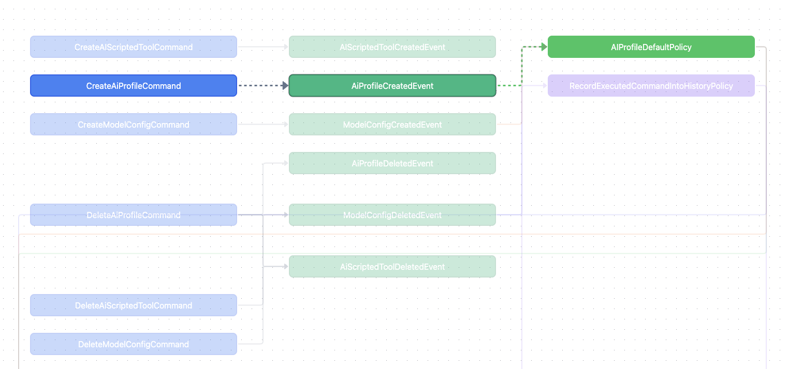

# Command Flow Visualizer

## Demonstration of the Result


http://event-storming-example.s3-website.ap-northeast-2.amazonaws.com/



## Purpose

There is a metholodogy of managing endpoints in a backend application called ***CQRS***. This suites perfectly to domain driven design because `Command` and `Event` are correct vocabularies to describe an event-based application system.

Based on different implementations on how a command and  a query are dispatched, one can always generate a mapping of `Command`s and `Event`s from the application in the following format:

```json
// data.json

{
    "commands": [
        {
            "from": "CreateAIScriptedToolCommand",
            "to": ["AIScriptedToolCreatedEvent"]
        }
    ],
    "policies": [
        {
            "policy": "AIProfileDefaultPolicy",
            "fromEvent": "AiProfileCreatedEvent",
            "toCommand": "SelectDefaultAiProfileCommand"
        }
    ]
}
```

In short:

- **Command.** Those would change the application state
- **Event.** Those describe a state change has happened
- **Policy.** Those descirbe how an event could create side effect. A policy would listen to an event, and dispatch another command.

  All side effect must take place in policies.


